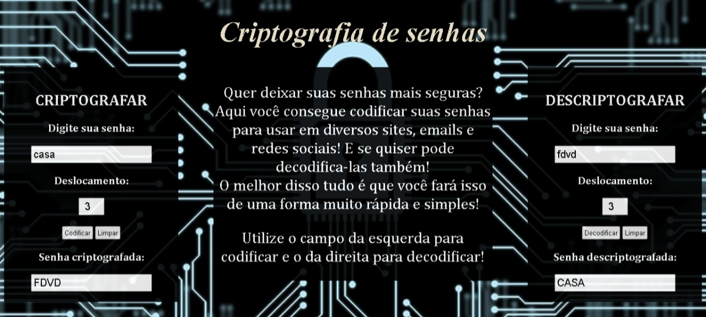

# 🔒 Criptografia de Senhas 🔒

## Índice

* [1. Cifra de César](#1-Cifra-de-César) 
* [2. Descrição do projeto](#2-Descrição-do-projeto)
* [3. Usuários](#3-Usuários)
* [4. Instruções de uso](#4-Instruções-de-uso)
* [5. Processo de desenvolvimento](#-Processo-de-desenvolvimento)

***

## 1. Cifra de César

A Cifra de César é uma técnica bem conhecida de criptografia, um tipo de cifra
de substituição, onde cada letra de uma palavra a ser criptografada é substituída
por outra letra presente no alfabeto, deslocada com um número de posições
à esquerda ou à direita.
Por exemplo se usarmos o deslocamento de 3 posições:

Alfabeto sem cifrar: A B C D E F G H I J K L M N O P Q R S T U V W X Y Z

Alfabeto com cifra: D E F G H I J K L M N O P Q R S T U V W X Y Z A B C

A letra A será D

A palavra CASA será FDVD

A cifra de César recebeu esse nome pois o Imperador Julio César a utilizava
para se comunicar com os seus generais.

## 2. Descrição do projeto

O projeto consiste em utilizar a tecnica da Cifra de César para codificar senhas e
torna-las mais seguras. De uma forma muito simples e rápida, o usuário consegue criar
senhas para usar em diversos sites, emails e redes sociais. E Além de codifica-las,
consegue decodifica-las também!

Para acessar [clique aqui]()

## 3. Usuários

A página pode ser utilizada por qualquer pessoa que deseja ter mais segurança e facilidade
na hora de criar suas senhas. 💻

## 4. Instruçoes de uso

* Acesse a página através desse [link]();
* Utilize o campo da esquerda para codificar;
* Utilize o campo da direita para decodificar;
* Digite a senha no campo escolhido;
* Selecione um número de deslocamento;
* Clique em codificar ou decodificar;
* Pronto! Sua nova senha será exibida no campo correspondente.

## 5. Processo de desenvolvimento 📝💻🙎🏻

➡️ Escolha do público alvo

➡️ Leitura para entender melhor a Cifra de César

➡️ Criação da estrutura da página

➡️ Estlização da página

➡️ Estudo de JavaScript

➡️ Criaçaõ das funções Encode e Decode

➡️ Estudo do DOM

➡️ Aplicação do DOM

➡️ Execução dos testes

➡️ Resolução dos problemas que surgiram nos testes

➡️ Revisão geral dos códigos

➡️ Criação do Readme

